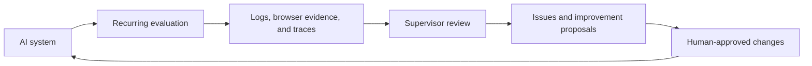
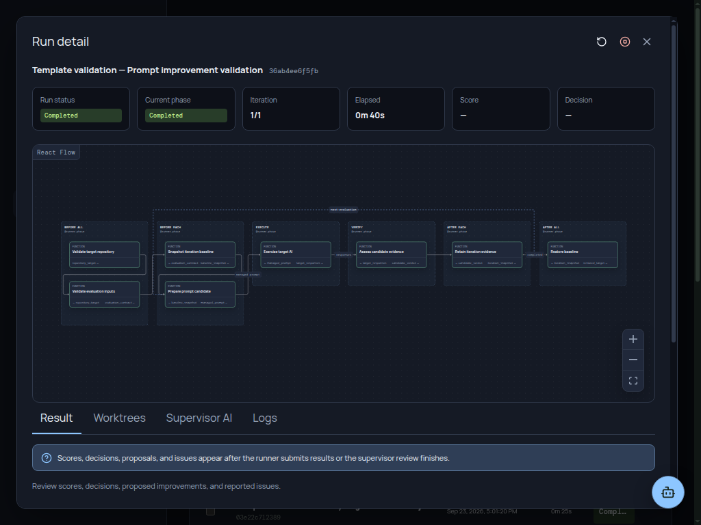
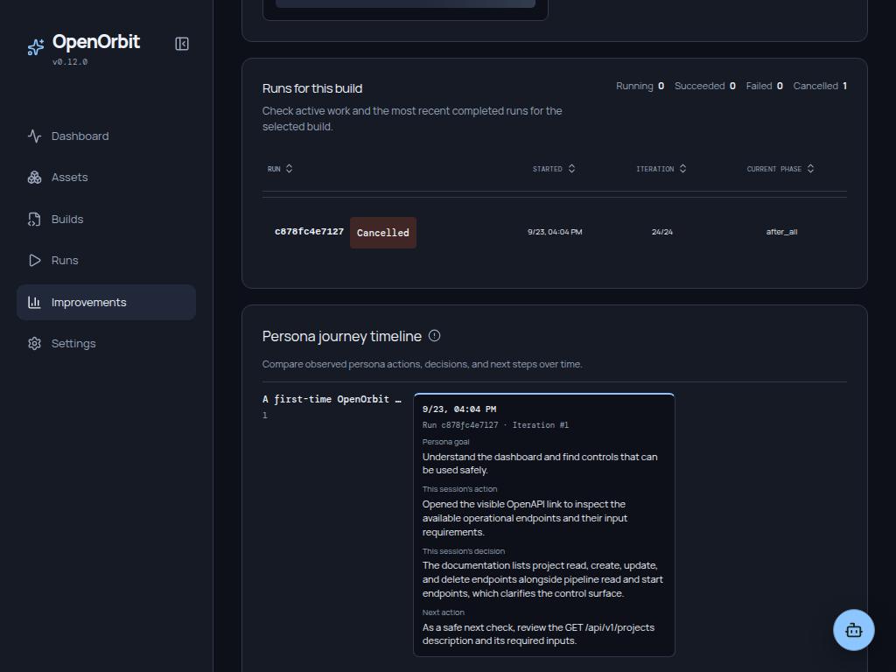
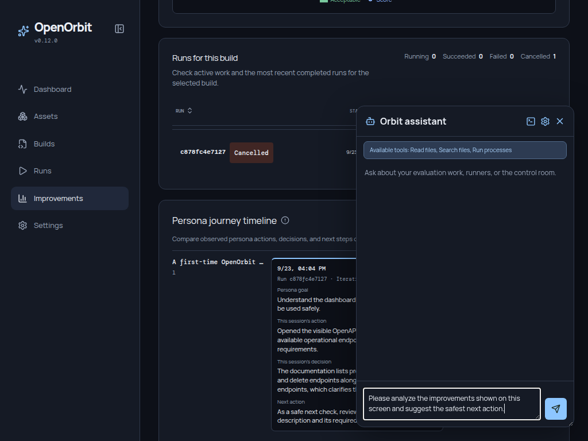

# OpenOrbit

> **The local control plane for continuously evaluating, supervising, and improving AI systems.**

OpenOrbit does not use AI merely to automate work. It automates the operating cycle around an AI system itself: evaluate it on a schedule, retain evidence, review supervisor feedback, and make its improvement history observable.

Run the control room locally, keep the operational record in your own AppData, and decide which changes deserve approval.

## Why OpenOrbit?

An AI feature can look healthy in a demo and still regress after a prompt, model, tool, or product change. OpenOrbit gives that feature a repeatable operating loop rather than a one-off test:



## What you can do

- Define reusable **evaluation builds** from a target, workflow, runner, fixed test cases, manager prompt, and AI model profile.
- Run a one-off **test** before saving a build, or run its configured lifecycle repeatedly with clear approval boundaries.
- Inspect every phase through process logs, structured evidence, browser screenshots, supervisor responses, and OpenTelemetry traces.
- Review reported issues and proposed improvements in a durable decision history.
- Observe the PDCA cycle across iterations instead of treating a single model response as the whole story.
- Stop active work from one local control room.

## Product tour

OpenOrbit is designed around the information an operator needs at each stage:

| Area | What it answers |
| --- | --- |
| **Dashboard** | Is the AI system healthy right now? What changed recently? |
| **Evaluation builds** | What exactly is being evaluated, with which assets and policy? |
| **Evaluation run detail** | What happened in each phase, and what evidence supports the result? |
| **Improvement results** | Are feedback, decisions, and scores actually improving over time? |

The screenshots below follow a customer-support AI through recurring quality
evaluation, an evidence-backed failed handoff, and a proposed improvement.

### Monitor a healthy AI system

Start with the operating picture: completed evaluations, active work, errors,
and the latest supervisor feedback. This lets an operator spot a regression
before opening an individual run.


### Review a successful evaluation result

Open a retained run to see the supervisor score and decision beside the
improvements and issues supported by that evaluation. Every proposal remains
connected to the iteration that produced it.



### Review evidence across the improvement cycle

Compare feedback volume, accepted changes, scores, and run health across
multiple evaluation builds. The history makes it clear whether the operating
cycle is improving the AI system over time.



### Ask an AI assistant what to do next

Configure a System AI model to use the built-in Chat Assistant for questions
about evaluation work, runners, and the control room. Your own AI agent can
work with the same local operating data through OpenOrbit's versioned API.



## Development partners

<table>
  <tr>
    <td align="center" width="240">
      <a href="https://insighta.cloud">
        
        <br /><br />
        <strong>insighta cloud Inc.</strong>
        <br />
        <sub>Development partner</sub>
      </a>
    </td>
  </tr>
</table>

## Build with us

We are looking for thoughtful collaborators who share our belief that AI
systems should be observable, controllable, and continuously improved. Start a
fork, open a small issue, improve the docs, or help shape a larger idea—every
contribution is welcome.

New to the project? Browse [good first issues](https://github.com/forthfate/openorbit/labels/good%20first%20issue),
ask a question or share an idea in [Issues](https://github.com/forthfate/openorbit/issues),
or read the [contribution guide](CONTRIBUTING.md) before opening a pull request.

## Quick start

### Start in 10 seconds with a Quick Start

Open the **Quick starts** section on the Dashboard, choose a guided template,
fill in the few target-specific fields, and create the evaluation build. Each
template creates the runner, fixed test cases, environments, manager policy,
and model profile configuration together—so you can start with a working
operating loop instead of assembling every asset by hand.

| Quick Start | Use it when | Example first run |
| --- | --- | --- |
| **User journey smoke test** | You need a recurring, read-only browser check for a local product. | Confirm that the home page loads and the primary heading is visible. |
| **Site exploration review** | You want evidence-backed product feedback from safe same-site exploration. | Explore the documentation or dashboard and retain the visited pages behind each recommendation. |
| **Agent self-improvement** | You want to improve a managed prompt from real AI responses. | Send a support request to the configured target model, retain its response, and let the supervisor approve only response-backed prompt changes. |
| **AI SLO and behavior drift monitor** | You already have a structured evaluator for quality, safety, latency, or cost. | Connect its probe command and compare the retained metrics with the configured baseline and thresholds. |

For example, to evaluate a support-agent prompt:

1. Choose **Agent self-improvement**.
2. Select the Git repository and managed prompt file, then choose your AI model profile.
3. Enter one representative user request and its response-level acceptance criterion.
4. Create the build and run it. OpenOrbit retains the actual target-AI response, asks the supervisor to review that evidence, and applies only an adopted, reversible prompt improvement on the following iteration.

Quick Starts never store provider keys. They reference the environment-variable
name already configured in the selected model profile.

### Requirements

| Requirement | Version | Used for |
| --- | --- | --- |
| Python | 3.13+ | Local API and runner SDK |
| Git | 2.40+ recommended | Install from Git and repository-backed evaluation cycles |
| Node.js | 24+ | Installing from Git and frontend development |

### Run the packaged app

Install the packaged release:

```bash
python -m pip install openorbit
orbit run
```

The wheel already includes the bundled control-room UI, so Node.js and pnpm are
not required at runtime.

> PyPI publication is made possible with the support of insighta cloud Inc.

To use the latest development version, install directly from the main OpenOrbit
repository. This source installation requires Node.js 24+ and pnpm:

```bash
python -m pip install "openorbit @ git+https://github.com/forthfate/openorbit.git@main"
```

Or run it once with npm:

```bash
npx openorbit run
```

Open `http://127.0.0.1:3000`. If that port is occupied, OpenOrbit selects the next available port and prints its URL. Set `ORBIT_PORT` and `ORBIT_HOST` when you need a specific listener:

```bash
ORBIT_PORT=8787 ORBIT_HOST=0.0.0.0 orbit run
```

### Run from this repository

```bash
git clone https://github.com/forthfate/openorbit.git
cd openorbit

uv sync --extra dev
corepack enable
pnpm install
pnpm run build
pnpm run run
```

For frontend development, start the API and Vite separately:

```bash
uv run uvicorn app.main:app --app-dir backend --reload --port 3000
pnpm --filter agent-improvement-console-ui run dev
```

Then open the Vite URL shown in the terminal, normally `http://localhost:5173`.

## Standalone and BYOA

OpenOrbit is a standalone, local-first control plane. It does not host or
resell an AI model, and it does not require an OpenOrbit cloud account.

Bring your own AI: create a model profile for the API provider and model your
team already uses, then select that profile for supervisor evaluation, Cycle
Improvement AI, or the Chat Assistant. OpenOrbit stores only the environment
variable name for a provider credential—not the credential itself—and keeps
the operational record in your local AppData.

### Browser journeys (optional)

Only evaluation builds that run browser journeys need a Chromium browser and
its platform-specific system libraries. This is not required to start
OpenOrbit, create assets, review runs, or use non-browser runners.

## Your first evaluation loop

1. Create or choose an AI model profile in **Assets**.
2. Add the runner, workflow, fixed test cases, and target environment that describe the AI system you want to evaluate.
3. Create an **Evaluation build** from those assets.
4. Use **Test** to execute the build once and inspect its full run detail without adding it to the evaluation-run history.
5. Start a regular run when ready, then review evidence and supervisor results in **Evaluation runs**.
6. Use **Improvement results** to compare scores, feedback, decisions, and cycle health over time.

## Core concepts

| Concept | Meaning |
| --- | --- |
| **Asset** | A reusable model profile, runner, workflow, prompt, test set, or environment. |
| **Evaluation build** | A versioned operating configuration that connects assets to one AI-system evaluation. |
| **Test** | A transient, one-time execution used to validate an evaluation build. |
| **Run** | A retained execution record, including phases, evidence, logs, and decisions. |
| **Supervisor** | An AI review step that produces structured evaluation results, issues, and proposals. |
| **Improvement cycle** | The evidence-backed PDCA loop across multiple evaluations and human decisions. |

## Safety and local data

OpenOrbit is local-first. Operational state is stored outside the repository in platform AppData:

- Windows: `%LOCALAPPDATA%\\Orbit`
- macOS: `~/Library/Application Support/Orbit`
- Linux: `${XDG_DATA_HOME:-~/.local/share}/orbit`

Set `ORBIT_APP_DATA` to use another location. Model profiles store the name of the environment variable that contains a secret, never the secret itself. Review workflow commands, approved workspace boundaries, and network exposure before connecting a production AI system.

## API and extensibility

OpenOrbit exposes a local, versioned API:

- Swagger UI: `http://localhost:3000/api/docs`
- OpenAPI document: `http://localhost:3000/api/openapi.json`
- API base: `http://localhost:3000/api/v1`

Read the [API reference](docs/API.md) for endpoint details. To add reusable automation, create a Python runner with explicit lifecycle phases:

```python
from orbit_sdk import runner

@runner.phase("run")
def evaluate(ctx):
    ctx.log("Run one bounded evaluation step")

if __name__ == "__main__":
    runner.main()
```

Runners are intentionally bounded. They provide evidence to the control plane; they do not start their own scheduler or silently modify a target system.

## Contributing

Contributions are welcome: bug reports, evaluation-runner templates, documentation improvements, and product feedback all help.

```bash
uv run ruff check orbit/ backend/ tests/
PYTHONPATH=backend uv run pytest -q
pnpm --filter agent-improvement-console-ui run lint
pnpm --filter agent-improvement-console-ui run build
```

Please open a pull request rather than pushing directly to `main`. See [CONTRIBUTING.md](CONTRIBUTING.md) for development, checks, and release rules.

## License

Copyright © 2026 forthfate and insighta cloud Inc.

Released under the [MIT License](LICENSE).
