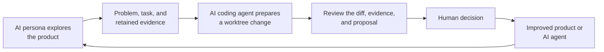
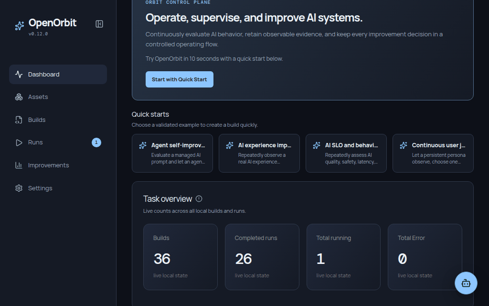
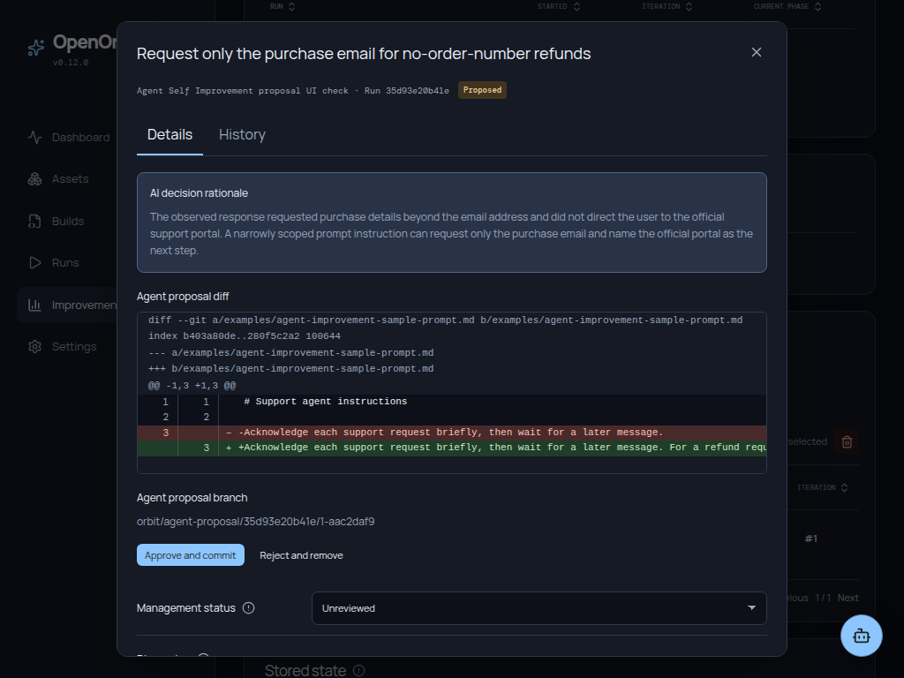

*Read this in other languages: [한국어](i18n/ko/README.md)*

<p align="center">
  
</p>

# What is OpenOrbit?

> **A local workspace where AI personas find product work, AI coding agents
> prepare changes, and your team reviews the result.**

OpenOrbit is a local-first web service for running the work around an AI
product—not only evaluating the agent itself. Personas explore a product,
report problems and tasks, and preserve the evidence. Your selected AI coding
agent can prepare a change in an isolated Git worktree; your team reviews the
diff, evidence, and decision in one control room.

It also supports repeatable AI-agent evaluation and self-improvement. Every
run, proposal, decision, and approved change becomes retained operational
history. Everything runs locally, and the record stays in your AppData.

## Why OpenOrbit?

An AI feature or web product can look healthy in a demo and still regress after
a prompt, model, tool, or product change. OpenOrbit connects the people,
personas, coding agents, and evidence needed to turn a reported problem into a
reviewable improvement:



OpenOrbit keeps this work visible and reversible: AI can propose and prepare
work, while people decide what is applied.

## What you can do

- **Develop reported problems with worktrees.** When AI reports a concrete
  problem, let a coding agent prepare an isolated change, then review its diff
  and evidence before deciding what to apply.
- **Use your preferred AI coding agent.** Connect the coding agent your team
  already uses instead of being tied to one provider.
- **Give AI personas work to do.** Personas explore from a defined point of
  view, surface tasks and problems, and keep their work connected to evidence.
- **Improve AI agents over time.** Repeated evaluations retain responses,
  feedback, proposals, and decisions so an AI agent can improve safely.
- **Manage personas and reusable assets.** Keep personas, model profiles,
  prompts, test cases, environments, and workflows ready for the next task.
- **Ask and operate with Orbit Assistant.** Ask about the screen you are
  viewing and use the assistant to help operate the control room.
- **Automate through MCP and OpenAPI.** Let your own agents and tools read the
  same local operating data and automate supported work.

## Quick start

Start with a guided template, then adapt it to the product, persona, and AI
workflow your team wants to operate.



### Start in 10 seconds with a Quick Start

Open **Quick starts** on the Dashboard, choose a guided template, fill in the
target-specific fields, and create a build. A template connects the needed
runner, test cases, environments, policy, and model profile so you can start
with a working workflow and refine it from there.

| Quick Start | Use it when | Example first run |
| --- | --- | --- |
| **User journey smoke test** | You need a recurring, read-only browser check for a local product. | Confirm that the home page loads and the primary heading is visible. |
| **Site exploration review** | You want evidence-backed product feedback from safe same-site exploration. | Explore the documentation or dashboard and retain the visited pages behind each recommendation. |
| **Agent self-improvement** | You want to improve a managed prompt from real AI responses. | Send a support request to the configured target model, retain its response, and let the supervisor approve only response-backed prompt changes. |
| **AI SLO and behavior drift monitor** | You already have a structured evaluator for quality, safety, latency, or cost. | Connect its probe command and compare the retained metrics with the configured baseline and thresholds. |

For example, to evaluate a support-agent prompt:

1. Choose **Agent self-improvement**.
2. Select the Git repository and managed prompt file, then choose your AI model profile.
3. Enter one representative user request and its response-level acceptance criterion.
4. Create the build and run it. OpenOrbit retains the actual target-AI response and asks the supervisor to classify evidence-backed, reversible prompt improvements as acceptable. Only a human-accepted proposal can be applied on a following iteration.

Quick Starts never store provider keys. They reference the environment-variable
name already configured in the selected model profile.

## Product tour

OpenOrbit's web control room keeps the work from discovery to decision in one
place. Its current navigation is organized around the work your team performs:

| Area | What you do there |
| --- | --- |
| **Dashboard** | See current activity and start a guided workflow. |
| **Assets** | Manage reusable personas, model profiles, prompts, test cases, environments, runners, and workflows. |
| **Builds** | Connect the assets and policy for a product or AI-agent workflow. |
| **Runs** | Inspect an execution and the evidence it produced. |
| **Improvements** | Follow feedback and persona journeys; review AI-reported issues and worktree proposals. |
| **Settings** | Configure models, coding agents, and the local control room. |

The screens below follow work from retained evidence to a reviewable AI-created
change.

### Inspect the evidence behind a run

Open a retained run to review its workflow, lifecycle progress, and the
evidence collected at each stage. Then compare the observed behavior with the
supervisor feedback and any proposed improvement.


### Follow improvement and persona activity

Compare feedback, decisions, scores, run health, and persona journeys across
builds. The history shows whether a product or AI-agent workflow is getting
better over time.


### Review AI-created work before it is applied

When retained evidence supports a concrete change, an AI coding agent can
prepare a proposal in an isolated worktree. Review its rationale, acceptance
evidence, and diff, then approve, reject, or keep it under review—nothing is
applied without a decision.



### Ask Orbit Assistant about the current screen

Configure a System AI model to use Orbit Assistant for questions about the
screen in front of you and help operating the control room. Your own AI agent
can work with the same local operating data through OpenOrbit's MCP server or
versioned API.


## Installation and development

### Requirements

| Requirement | Version | Used for |
| --- | --- | --- |
| Python | 3.13+ | Local API and runner SDK |
| Git | 2.40+ recommended | Install from Git and repository-backed evaluation cycles |
| Node.js | 24+ | Installing from Git and frontend development |

### Runner SDK documentation

The runner SDK reference is generated from the Python module and its
docstrings. Preview it locally with:

```bash
pnpm run docs:serve
```

Build a static documentation site with `pnpm run docs:build`, or
run `pnpm run build` to generate both the SDK docs and the control-room UI.

### Run the packaged app

For the standard packaged release, install OpenOrbit and start it:

```bash
python -m pip install openorbit
orbit run
```

The wheel already includes the bundled control-room UI, so Node.js and pnpm are
not required at runtime. Open `http://127.0.0.1:3000` after it starts. If that
port is occupied, OpenOrbit selects the next available port and prints its URL.

To keep one control room's operational data with a project or another chosen
directory, pass that directory to `run`. OpenOrbit creates and uses its
`.orbit` subdirectory:

```bash
orbit run .            # Store data in the current directory's .orbit/
orbit run ./my-project # Store data in ./my-project/.orbit/
```

To use a specific listener, set `ORBIT_PORT` and `ORBIT_HOST`:

```bash
ORBIT_PORT=8787 ORBIT_HOST=0.0.0.0 orbit run
```

### Other ways to start

To use the latest development version, install directly from the main OpenOrbit
repository. This source installation requires Node.js 24+ and pnpm:

```bash
python -m pip install "openorbit @ git+https://github.com/forthfate/openorbit.git@main"
```

Or run it once with npm:

```bash
npx openorbit run
```

> PyPI publication is made possible with the support of insighta cloud Inc.

### Run from this repository

```bash
git clone https://github.com/forthfate/openorbit.git
cd openorbit

uv sync --extra dev
corepack enable
pnpm install
pnpm run build
pnpm run run
```

For frontend development, start the API and Vite separately:

```bash
uv run uvicorn app.main:app --app-dir backend --reload --port 3000
pnpm --filter agent-improvement-console-ui run dev
```

Then open the Vite URL shown in the terminal, normally `http://localhost:5173`.

## Standalone and BYOA

OpenOrbit is a standalone, local-first control plane. It does not host or
resell an AI model, and it does not require an OpenOrbit cloud account.

Bring your own AI: create a model profile for the API provider and model your
team already uses, then select that profile for supervisor evaluation, Cycle
Improvement AI, or the Chat Assistant. OpenOrbit stores only the environment
variable name for a provider credential—not the credential itself—and keeps
the operational record in your local AppData.

### Browser journeys (optional)

Only builds that run browser journeys need a Chromium browser and
its platform-specific system libraries. This is not required to start
OpenOrbit, create assets, review runs, or use non-browser runners.

## Core concepts

> A Build defines the operating loop. A Test checks it once. A Run preserves
> what happened. A Supervisor turns evidence into feedback and proposals. Your
> team decides what changes next.

| Concept | Meaning |
| --- | --- |
| **Asset** | A reusable model profile, runner, workflow, prompt, test set, or environment. |
| **Build** | A versioned operating configuration that connects assets to one AI-system evaluation. |
| **Test** | A transient, one-time execution used to validate a build. |
| **Run** | A retained execution record, including phases, evidence, logs, and decisions. |
| **Supervisor** | An AI review step that produces structured evaluation results, issues, and proposals. |
| **Improvement cycle** | The evidence-backed PDCA loop across multiple evaluations and human decisions. |

## Safety and local data

OpenOrbit is local-first. By default, operational state is stored outside the
repository in platform AppData:

- Windows: `%LOCALAPPDATA%\\Orbit`
- macOS: `~/Library/Application Support/Orbit`
- Linux: `${XDG_DATA_HOME:-~/.local/share}/orbit`

Use `orbit run PATH` to keep the data in `PATH/.orbit`; this takes precedence
over a previously selected data location and `ORBIT_APP_DATA` for that run. Add
`.orbit/` to the target project's `.gitignore` when it is not meant to be
version-controlled. Set `ORBIT_APP_DATA` to use another location without a
command-line path. Model profiles store the name of the environment variable
that contains a secret, never the secret itself. Review workflow commands,
approved workspace boundaries, and network exposure before connecting a
production AI system.

## API and extensibility

OpenOrbit exposes a local, versioned API:

- Swagger UI: `http://localhost:3000/api/docs`
- OpenAPI document: `http://localhost:3000/api/openapi.json`
- API base: `http://localhost:3000/api/v1`
- MCP (Streamable HTTP): `http://localhost:3000/mcp/`

Use MCP or the versioned OpenAPI to connect your own agents and automate
supported work with the same local operating data. Read the
[API reference](docs/API.md) for endpoint details. To add reusable automation,
create a Python runner with explicit lifecycle phases:

```python
from orbit_sdk import runner

@runner.phase("execute")
def verify(ctx):
    ctx.log("Run one bounded evaluation step")

if __name__ == "__main__":
    runner.main()
```

Runners provide evidence to the control plane without starting their own
scheduler or silently modifying a target system.

## Build with us

We are looking for thoughtful collaborators who share our belief that AI
systems should be observable, controllable, and continuously improved.
Contributions are especially welcome from people working on agent harnesses,
browser evaluation (including Playwright), local automation, and evidence-backed
operational loops. Start a fork, open a small issue, improve the docs, or help
shape a larger idea—every contribution is welcome.

New to the project? Browse [good first issues](https://github.com/forthfate/openorbit/labels/good%20first%20issue),
ask a question or share an idea in [Issues](https://github.com/forthfate/openorbit/issues),
or read the [contribution guide](CONTRIBUTING.md) before opening a pull request.

## Contributing

Contributions are welcome: bug reports, evaluation-runner templates,
documentation improvements, and product feedback all help.

```bash
uv run ruff check orbit/ backend/ tests/
PYTHONPATH=backend uv run pytest -q
pnpm --filter agent-improvement-console-ui run lint
pnpm --filter agent-improvement-console-ui run build
```

Please open a pull request rather than pushing directly to `main`. See [CONTRIBUTING.md](CONTRIBUTING.md) for development, checks, and release rules.

## Development partners

<table>
  <tr>
    <td align="center" width="240">
      <a href="https://insighta.cloud">
        
        <br /><br />
        <strong>insighta cloud Inc.</strong>
        <br />
        <sub>Development partner</sub>
      </a>
    </td>
  </tr>
</table>

## License

Copyright © 2026 forthfate and insighta cloud Inc.

Released under the [MIT License](LICENSE).
